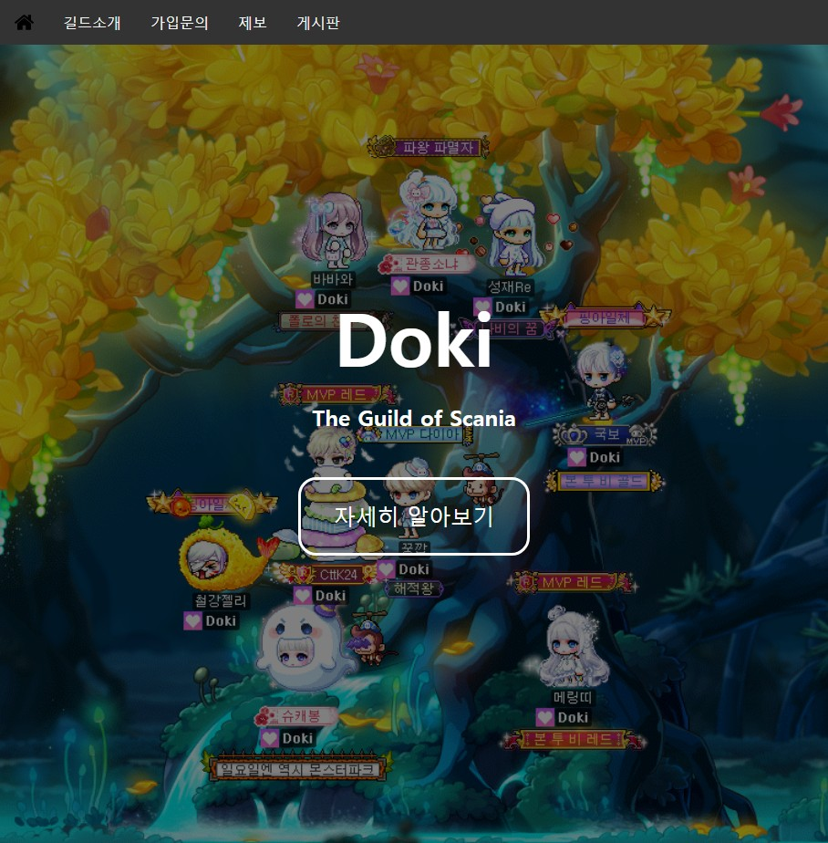

# Guildweb

## Description

A web project for the Doki guild's promotion & community

### Features

* Report (w/ File upload)
* WYSIWIG Board
* Sign in / up (under progress)
* Comments or Likes (not yet)

## Getting Started

### Dependencies

* SpringBoot v2.3.1
* Thymeleaf
* Gson
* Jsoup
* Querydsl
 
Check pom.xml for all dependencies.

### Dev Environment

* IntelliJ IDEA 2020.1.2 (or higher)

### Database prerequisite

* MariaDB 10.3 (or higher)
* A scheme named 'guildweb' (default)

 
Tables will be generated automatically by JPA.
 
Check 'resources/application.properties' for more db settings.

### How to run project

1. Build the project first (Ctrl + F9)
2. Run 'GuildwebApplication' (Shift + F10)

Tomcat is built-in. No need for any other WAS 